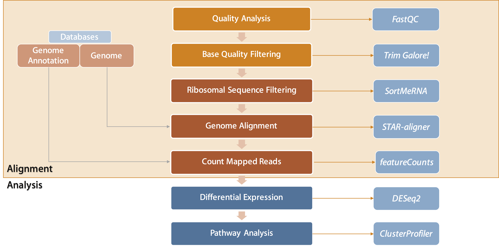
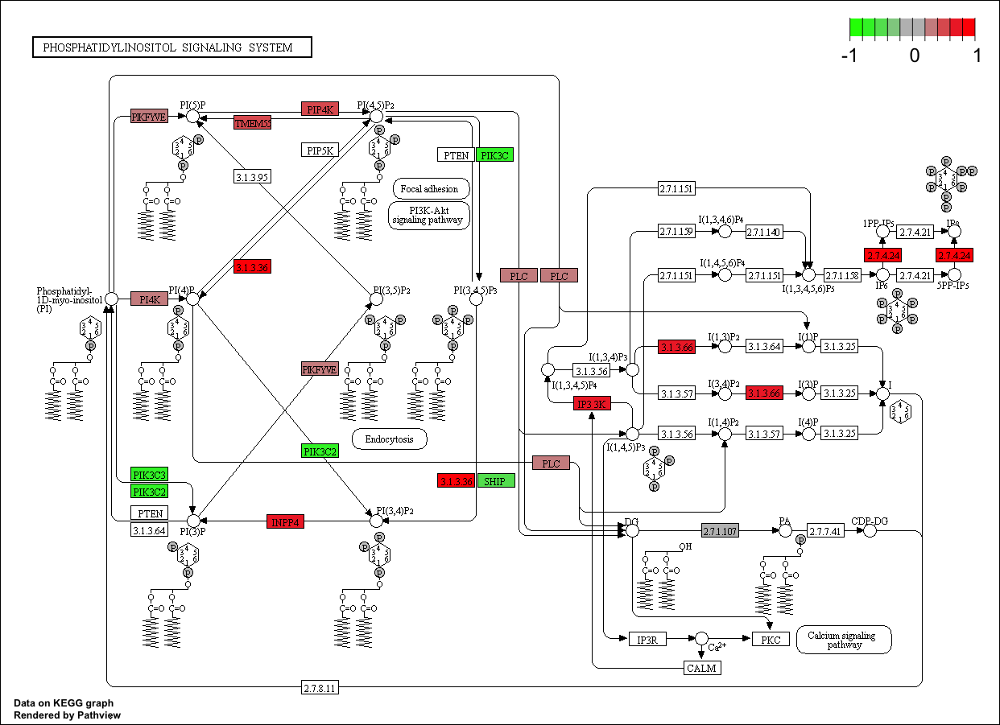

```{r setup, include=FALSE}
library(knitr)
knitr::opts_chunk$set(echo = TRUE)
library(DESeq2)
library(ggplot2) 
library(knitr)
library(clusterProfiler)
library(biomaRt)
library(ReactomePA)
library(DOSE)
library(KEGG.db)
library(org.Mm.eg.db)
library(org.Hs.eg.db)
library(pheatmap)
library(genefilter)
library(RColorBrewer)
library(GO.db)
library(topGO)
library(dplyr)
library(gage)
library(ggsci)
```

##### Thomas W. Battaglia (02/15/17)

### Introduction
RNAseq is becoming the one of the most prominent methods for measuring celluar responses. Not only does RNAseq have the ability to analyze differences in gene expression between samples, but can discover new isoforms and analyze SNP variations. This tutorial will cover the basic workflow for processing and analyzing differential gene expression data and is meant to give a general method for setting up an environment and running alignment tools. Be aware that is not meant to be used for all types of analyses and data-types, and the alignment tools are not for every analysis. Additionally, this tutorial is focused on giving a general sense of the flow when performing these analysis. For larger scale studies, it is highly reccomended to use a HPC environment for increased RAM and computational power.


### Getting Setup 

#### A. Installating Miniconda (if needed)
Miniconda is a comprehensive and easy to use package manager for Python (among other things). Miniconda is meant to replace your current Python installation with one that has more features and is modular, so you can delete it without any damage to your system. Not only does it allow you to install Python packages, you can create virtual environments and have access to large bioinformatics repositories (**Bioconda** https://bioconda.github.io/). 

```{bash, eval = F}
# Download the Miniconda3 installer to your home directory (Only for macOS)
<<<<<<< HEAD
wget https://repo.continuum.io/miniconda/Miniconda3-latest-MacOSX-x86_64.sh -O ~/miniconda.sh

# Download the Miniconda3 installer to your home directory (Only for LINUX or Cluster)
wget https://repo.continuum.io/miniconda/Miniconda3-latest-Linux-x86_64.sh -O ~/miniconda.sh
=======
wget https://repo.continuum.io/miniconda/Miniconda2-latest-MacOSX-x86_64.sh -O ~/miniconda.sh

# Download the Miniconda3 installer to your home directory (Only for LINUX or Cluster)
wget https://repo.continuum.io/miniconda/Miniconda2-latest-Linux-x86_64.sh -O ~/miniconda.sh
>>>>>>> origin/master

# Run the miniconda installation
bash miniconda.sh -b -f -p ~/miniconda

# Add miniconda to the system path
echo 'PATH="$HOME/miniconda/bin:$PATH' >> ~/.bash_profile

# Source system file to activate miniconda
source ~/.bash_profile

# Add bioinformatic channels for downloading required packages
conda config --add channels conda-forge
conda config --add channels defaults
conda config --add channels r
conda config --add channels bioconda
```


#### B. Setting Up the Folder Structure
Organizing is key to proper reproducible research. During the processing and analysis steps, many files are created. To best organize the analysis and increase the reproducibility of your analysis, it is best to use a simple folder structure. An intuitive struture allows other researchers and collaborators to find certain files and follow the steps used. The structure within this repository is just one way of organizing the data, but you can choose whichever way is the most comfortable.
```{bash, eval = F}
# Install git (if needed)
conda install -c anaconda git wget --yes

# Clone this repository with folder structure into the current working folder
git clone https://github.com/twbattaglia/RNAseq-workflow new_workflow

# Change directory into the new folder
cd new_workflow
```


##### Folder breakdown
```{bash, eval = F}
── new_workflow/
  │   └── annotation/               <- Genome annotation file (.GTF/.GFF)
  │  
  │   └── genome/                   <- Host genome file (.FASTA)
  │  
  │   └── input/                    <- Location of input  RNAseq data
  │  
  │   └── output/                   <- Data generated during processing steps
  │       ├── 1_initial_qc/         <- Main alignment files for each sample
  │       ├── 2_trimmed_output/     <-  Log from running STAR alignment step
  │       ├── 3_rRNA/               <- STAR alignment counts output (for comparison with featureCounts)
  │           ├── aligned/          <-  Sequences that aligned to rRNA databases (rRNA contaminated)
  │           ├── filtered/         <-  Sequences with rRNA sequences removed  (rRNA-free)
  │           ├── logs/             <- logs from running SortMeRNA
  │       ├── 4_aligned_sequences/  <- Main alignment files for each sample
  │           ├── aligned_bam/      <-  Alignment files generated from STAR (.BAM)
  │           ├── aligned_logs/     <- Log from running STAR alignment step
  │       ├── 5_final_counts/       <- Summarized gene counts across all samples
  │       ├── 6_multiQC/            <- Overall report of logs for each step
  │  
  │   └── sortmerna_db/             <- Folder to store the rRNA databases for SortMeRNA
  │       ├── index/                <- indexed versions of the rRNA sequences for faster alignment
  │       ├── rRNA_databases/       <- rRNA sequences from bacteria, archea and eukaryotes
  │  
  │   └── star_index/               <-  Folder to store the indexed genome files from STAR 
```


#### C. Download Host Genome
To find either differentially expressed genes or isoform transcripts, you first need a reference genome to compare to. For any alignment, we need the host genome in `.fasta` format, but we also need an annotation file in `.GTF/.GFF`, which relates the coordinates in the genome to an annotated gene identifier. Both of these files are required to perform an alignment and generate gene abundance counts. Be aware that the different resources (Ensembl, UCSC, RefSeq, Gencode) have different versions of the same species genome and annotation files cannot be mixed between versions. In this workflow, we will focus on the Gencode's genome. (https://www.gencodegenes.org/)

See here for a listing of genomes/annotation beyond mouse and human: http://useast.ensembl.org/info/data/ftp/index.html

##### Mouse (Gencode)
```{bash, eval = F}
# Download genome fasta file into the genome/ folder
wget -P genome/ ftp://ftp.sanger.ac.uk/pub/gencode/Gencode_mouse/release_M12/GRCm38.p5.genome.fa.gz

# Download annotation file into the annotation/ folder
wget -P annotation/ ftp://ftp.sanger.ac.uk/pub/gencode/Gencode_mouse/release_M12/gencode.vM12.annotation.gtf.gz

# Decompress files for use with tools
gunzip genome/GRCm38.p4.genome.fa.gz
gunzip annotation/gencode.vM12.annotation.gtf.gz
```

##### Human (Gencode)
```{bash, eval = F}
# Download genome fasta file into the genome/ folder
wget -p genome/ ftp://ftp.sanger.ac.uk/pub/gencode/Gencode_human/release_25/GRCh38.p7.genome.fa.gz

# Download annotation file into the annotation/ folder
wget -P annotation/ ftp://ftp.sanger.ac.uk/pub/gencode/Gencode_human/release_25/gencode.v25.annotation.gtf.gz

# Decompress files for use with tools
gunzip genome/GRCh38.p7.genome.fa.gz
gunzip annotation/gencode.v25.annotation.gtf.gz
```

---

### Workflow



##### Example data: If you would like to use example data for practicing the workflow, run the command below to download mouse RNAseq data.
```
wget -P input/ ftp://ftp.sra.ebi.ac.uk/vol1/fastq/SRR137/001/SRR1374921/SRR1374921.fastq.gz
wget -P input/ ftp://ftp.sra.ebi.ac.uk/vol1/fastq/SRR137/002/SRR1374922/SRR1374922.fastq.gz
wget -P input/ ftp://ftp.sra.ebi.ac.uk/vol1/fastq/SRR137/003/SRR1374923/SRR1374923.fastq.gz
wget -P input/ ftp://ftp.sra.ebi.ac.uk/vol1/fastq/SRR137/004/SRR1374924/SRR1374924.fastq.gz
```

----

### Step 1. Analysing Sequence Quality with FastQC
http://www.bioinformatics.babraham.ac.uk/projects/fastqc/  

#### Description
"FastQC aims to provide a simple way to do some quality control checks on raw sequence data coming from high throughput sequencing pipelines. It provides a modular set of analyses which you can use to give a quick impression of whether your data has any problems of which you should be aware before doing any further analysis."

The first step before processing any samples is to analyze the quality of the data. Within the `fastq` file is quality information that refers to the accuracy (% confidence) of each base call. **FastQC** looks at different aspects of the sample sequences to determine any irregularies or features that make affect your results (adapter contamination, sequence duplication levels, etc.)

#### Installation
```
conda install -c bioconda fastqc --yes
```

#### Command
```
# Help
fastqc -h

# Run FastQC
fastqc \
-o results/1_initial_qc/ \
--noextract \
input/sample.fastq
```

#### Output
```{bash, eval = F}
── results/1_initial_qc/
    └──  sample_fastqc.html   <-  HTML file of FastQC fquality analysis figures
    └──  sample_fastqc.zip    <- FastQC report data
```

---

### Step 2. Removing Low Quality Sequences with Trim_Galore!
http://www.bioinformatics.babraham.ac.uk/projects/trim_galore/  
http://journal.embnet.org/index.php/embnetjournal/article/view/200

#### Description
"Trim Galore! is a wrapper script to automate quality and adapter trimming as well as quality control, with some added functionality to remove biased methylation positions for RRBS sequence files (for directional, non-directional (or paired-end) sequencing)."

After analyzing the quality of the data, the next step is to remove sequences/nucleotides that do not meet your quality standards. There are a multitude of quality control pacakges, but trim_galore combines **Cutadapt** (http://cutadapt.readthedocs.io/en/stable/guide.html) and **FastQC** to remove low quality sequences while performing quality analysis to see the effect of filtering.

The 2 most import parameters to select are what the minimum Phred score (1-30) and a minimum sequencing length. There are different views on this parameter and you can see the papers below for more information about which parameters to use. A good estimate is typically a Phred score of 20 (99% confidence) and a minimum of 50-70% of the sequence length.   
- https://bmcbioinformatics.biomedcentral.com/articles/10.1186/s12859-016-0956-2  
- https://genomebiology.biomedcentral.com/articles/10.1186/s13059-016-0881-8   
- http://www.epigenesys.eu/images/stories/protocols/pdf/20150303161357_p67.pdf  

#### Installation
```
conda install -c bioconda trim-galore --yes
```

#### Command
```
# Help
trim_galore -h

# Run Trim Galore!
trim_galore \
--quality 20 \
--fastqc \
--length 25 \
--output_dir results/2_trimmed_output/ \
input/sample.fastq
```

#### Output
```{bash, eval = F}
── results/2_trimmed_output/
     └──  sample_trimmed.fq                 <-  Trimmed sequencing file (.fastq)
     └──  sample_trimmed.html               <- HTML file of FastQC fquality analysis figures
     └──  sample_trimmed.zip                <- FastQC report data
     └──  sample.fastq.trimming_report.txt  <-   Cutadapt trimming report
```

---

### Step 3. Removing rRNA Sequences with SortMeRNA
http://bioinfo.lifl.fr/RNA/sortmerna/  
http://bioinformatics.oxfordjournals.org/content/28/24/3211

#### Description
"SortMeRNA is a program tool for filtering, mapping and OTU-picking NGS reads in metatranscriptomic and metagenomic data. The core algorithm is based on approximate seeds and allows for fast and sensitive analyses of nucleotide sequences. The main application of SortMeRNA is filtering ribosomal RNA from metatranscriptomic data."

Once we have removed low quality sequences and remove any adapter contamination, we can then proceed to an additional (and optional) step to remove rRNA sequences from the samples. If your samples were not prepared with an rRNA depletion protocol before library preparation, it is reccomended to run this step to computational remove any rRNA sequence contiamation that may otheriwse take up a majority of the aligned sequences. 

#### Installation
```
conda install -c bioconda sortmerna --yes
```

#### Generating Indexes
Before we can run the `sortmerna` command, we must first download and process the eukaryotic, archeal and bacterial rRNA databases. The `sortmerna_db/` folder will be the location that we will keep the files necessary to run **SortMeRNA**. These databases only need to be created once, so any future RNAseq experiements can use these files.

```
# Download the sortmerna package (~2min) into sortmerna_db folder
wget -P sortmerna_db https://github.com/biocore/sortmerna/archive/2.1b.zip

# Decompress folder 
unzip sortmerna_db/2.1b.zip -d sortmerna_db

# Move the database into the correct folder
mv sortmerna_db/sortmerna-2.1b/rRNA_databases/ sortmerna_db/

# Remove unnecessary folders
rm sortmerna_db/2.1b.zip
rm -r sortmerna_db/sortmerna-2.1b

# Save the location of all the databases into one folder
sortmernaREF=sortmerna_db/rRNA_databases/silva-arc-16s-id95.fasta,sortmerna_db/index/silva-arc-16s-id95:\
sortmerna_db/rRNA_databases/silva-arc-23s-id98.fasta,sortmerna_db/index/silva-arc-23s-id98:\
sortmerna_db/rRNA_databases/silva-bac-16s-id90.fasta,sortmerna_db/index/silva-bac-16s-id95:\
sortmerna_db/rRNA_databases/silva-bac-23s-id98.fasta,sortmerna_db/index/silva-bac-23s-id98:\
sortmerna_db/rRNA_databases/silva-euk-18s-id95.fasta,sortmerna_db/index/silva-euk-18s-id95:\
sortmerna_db/rRNA_databases/silva-euk-28s-id98.fasta,sortmerna_db/index/silva-euk-28s-id98

# Run the indexing command (~8 minutes)
indexdb_rna --ref $sortmernaREF
```

#### Command
###### Note: Be sure the input files are not compressed
```
# Help
sortmerna -h

# Save variable of rRNA databases
# Save the location of all the databases into one folder
sortmernaREF=sortmerna_db/rRNA_databases/silva-arc-16s-id95.fasta,sortmerna_db/index/silva-arc-16s-id95:\
sortmerna_db/rRNA_databases/silva-arc-23s-id98.fasta,sortmerna_db/index/silva-arc-23s-id98:\
sortmerna_db/rRNA_databases/silva-bac-16s-id90.fasta,sortmerna_db/index/silva-bac-16s-id95:\
sortmerna_db/rRNA_databases/silva-bac-23s-id98.fasta,sortmerna_db/index/silva-bac-23s-id98:\
sortmerna_db/rRNA_databases/silva-euk-18s-id95.fasta,sortmerna_db/index/silva-euk-18s-id95:\
sortmerna_db/rRNA_databases/silva-euk-28s-id98.fasta,sortmerna_db/index/silva-euk-28s-id98

# Run SortMeRNA (~15min)
sortmerna \
--ref $sortmernaREF \
--reads results/2_trimmed_output/sample_trimmed.fq \
--aligned results/3_rRNA/aligned/sample_aligned.fq \
--other results/3_rRNA/filtered/sample_filtered.fq \
--fastx \
--log \
-a 4 \
-v

# Move logs into the correct folder
mv -v results/3_rRNA/aligned//sample_aligned.log results/3_rRNA/logs
```

#### Output
```{bash, eval = F}
── results/3_rRNA/
    └── aligned/sample_aligned.fq     <-  sequences with rRNA contamination
    └── filtered/sample_filtered.fq   <- sequences without any rRNA contamination
    └── logs/sample_aligned.log       <- log from SortMeRNA analysis
```


---


### Step 4. Aligning to Genome with STAR-aligner
https://github.com/alexdobin/STAR   
https://www.ncbi.nlm.nih.gov/pubmed/23104886  

#### Description
"To align our large (>80 billon reads) ENCODE Transcriptome RNA-seq dataset, we developed the Spliced Transcripts Alignment to a Reference (STAR) software based on a previously undescribed RNA-seq alignment algorithm that uses sequential maximum mappable seed search in uncompressed suffix arrays followed by seed clustering and stitching procedure. STAR outperforms other aligners by a factor of >50 in mapping speed, aligning to the human genome 550 million 2 × 76 bp paired-end reads per hour on a modest 12-core server, while at the same time improving alignment sensitivity and precision."

The **STAR** aligner is a very fast and efficent spliced aligner tools for aligning RNAseq data to genomes.  The **STAR** aligner has the capabilities to discover non-canonical splices and chimeric (fusion) transcripts, but for our use case, we will be using to to align full length RNA sequences to a genome. The output of the tool is a `.BAM` file which representes the coordinated that each sequence has aligned to. `.BAM` files are the same as `.SAM` files, but the are in binary format so you can not view the contents, yet this trade off reduces the size of the file dramatically.

#### Installation
```
conda install -c bioconda star --yes
```

#### Generating Indexes
Similar to the **SortMeRNA** step, we must first generate an index of the genome we want to align to, so that there tools can efficently map over millions of sequences. The `star_index` folder will be the location that we will keep the files necessary to run **STAR** and due to the nature of the program, it can take up to 30GB of space. This step only needs to be run once and can be used for any subsequent RNAseq alignment analyses.

##### Note the two inputs for this command are the genome located in the (genome/ folder) and the annotation file located in the (annotation/ folder)

```
# This can take up to 30 minutes to complete
STAR \
--runMode genomeGenerate \
--genomeDir star_index \
--genomeFastaFiles genome/* \
--sjdbGTFfile annotation/* \
--runThreadN 4
```


#### Command
```
# Help
STAR -h

# Run STAR (~10min)
STAR \
--genomeDir star_index \
--readFilesIn filtered/sample_filtered.fq  \
--runThreadN 4 \
--outSAMtype BAM SortedByCoordinate \
--quantMode GeneCounts

# Move the BAM file into the correct folder
mv -v results/4_aligned_sequences/sampleAligned.sortedByCoord.out.bam results/4_aligned_sequences/aligned_bam/

# Move the logs into the correct folder
mv -v results/4_aligned_sequences/${BN}Log.final.out results/4_aligned_sequences/aligned_logs/
mv -v results/4_aligned_sequences/sample*Log.out results/4_aligned_sequences/aligned_logs/
```

#### Output
```{bash, eval = F}
── results/4_aligned_sequences/
    └── aligned_bam/sampleAligned.sortedByCoord.out.bam   <- Sorted BAM alignment fole
    └── aligned_logs/sampleLog.final.out                  <- Log of STAR alignment rate
    └── aligned_logs/sampleLog.out                        <- Log of steps take during STAR alignment
```

---

### Step 5. Summarizing Gene Counts with featureCounts
https://www.ncbi.nlm.nih.gov/pubmed/24227677

#### Description
"featureCounts is a highly efficient general-purpose read summarization program that counts mapped reads for genomic features such as genes, exons, promoter, gene bodies, genomic bins and chromosomal locations. It can be used to count both RNA-seq and genomic DNA-seq reads. featureCounts takes as input SAM/BAM files and an annotation file including chromosomal coordinates of features. It outputs numbers of reads assigned to features (or meta-features). It also outputs stat info for the overall summrization results, including number of successfully assigned reads and number of reads that failed to be assigned due to various reasons (these reasons are included in the stat info)."

Now that we have our .BAM alignment files, we can then proceed to try and summarize these coordinates into genes and abundances. To do this we must summarize the reads using **featureCounts** or any other read summarizer tool, and produce a table of genes by samples with raw sequence abundances. This table will then be used to perform statistical analysis and find differentially expressed genes.

#### Installation
```
conda install -c bioconda subread --yes
```

#### Command
```
# Help
featureCounts -h

# Change directory into the aligned .BAM folder
cd results/4_aligned_sequences/aligned_bam

# Store list of files as a variable
dirlist=$(ls -t ./*.bam | tr '\n' ' ')
echo $dirlist

# Run featureCounts on all of the samples (~10 minutes)
featureCounts \
-a ../../annotation/* \
-o ../../results/5_final_counts/final_counts.txt \
-g 'gene_name' \
-T 4 \
$dirlist

# Change directory back to main folder
cd ../../../
```

#### Output
```{bash, eval = F}
── results/5_final_counts/
    └── final_counts.txt                <- Final gene counts across all samples
    └── final_counts.txt.summary        <- Summary of gene summarization 
```

---

### Step 6. Generating analysis report with multiQC
http://multiqc.info/
https://www.ncbi.nlm.nih.gov/pubmed/27312411

#### Description
"We present MultiQC, a tool to create a single report visualising output from multiple tools across many samples, enabling global trends and biases to be quickly identified. MultiQC can plot data from many common bioinformatics tools and is built to allow easy extension and customization."

During the qulaity filtering, rRNA removal, **STAR** alignment and gene summarization, there has been a creation of multiple log files which contain metrics the measure the quality of the respective step. Instead of iterating through many many different log files, we can use the summarization tool **MultiQC** which will search for all relavent files and produce rich figures that show data from different steps logs files. This step is extremely useful when determining how well sequences aligned to a genome and dermining how many sequences were lost at each step.

#### Installation
```
conda install -c bioconda multiqc --yes
```

#### Command
```
# Help
multiqc -h 

# Run multiqc and output results into final folder
multiqc results \
--outdir results/6_multiQC
```

#### Output
```{bash, eval = F}
── results/6_multiQC/
    └── multiqc_report.html     <- Beautiful figures representing the logs from each step
    └── multiqc_data/           <-  Folder of data that multiqc found from various log files
```


----

### Step 7. Importing Gene Counts into R/RStudio
Once the workflow has completed, you can now use the gene count table as an input into **DESeq2** for statistical analysis using the R-programming language. It is highly reccomended to use **RStudio** when writing R code and generating R-related analyses. You can download **RStudio** for your system here: https://www.rstudio.com/products/rstudio/download/  

##### 7a. Install required R-libraries
```{r install, eval = F}
source("https://bioconductor.org/biocLite.R")
biocLite("DESeq2") ; library(DESeq2)
biocLite("ggplot2") ; library(ggplot2)
biocLite("clusterProfiler") ; library(clusterProfiler)
biocLite("biomaRt") ; library(biomaRt)
biocLite("ReactomePA") ; library(ReactomePA)
biocLite("DOSE") ; library(DOSE)
biocLite("KEGG.db") ; library(KEGG.db)
biocLite("org.Mm.eg.db") ; library(org.Mm.eg.db)
biocLite("org.Hs.eg.db") ; library(org.Hs.eg.db)
biocLite("pheatmap") ; library(pheatmap)
biocLite("genefilter") ; library(genefilter)
biocLite("RColorBrewer") ; library(RColorBrewer)
biocLite("GO.db") ; library(GO.db)
biocLite("topGO") ; library(topGO)
biocLite("dplyr") ; library(dplyr)
biocLite("gage") ; library(gage)
biocLite("ggsci") ; library(ggsci)
```


##### 7b. Import featureCounts output
One you have an R environment appropriatley set up, you can begin to import the **featureCounts** table found within the ```5_final_counts``` folder. This tutorial will use **DESeq2** to normalize and perform the statistical analysis between sample groups. Be sure to know the full location of the ```final_counts.txt``` file generate from **featureCounts**.

##### Note: If you would like to use an example final_counts.txt table, look into the example/ folder.

```{r featureCounts, eval = T, warning  = F, message = F}
# Import gene counts table
# - skip first row (general command info)
# - make row names the gene identifiers
countdata <- read.table("example/final_counts.txt", header = TRUE, skip = 1, row.names = 1)

# Remove .bam + '..' from column identifiers
colnames(countdata) <- gsub(".bam", "", colnames(countdata), fixed = T)
colnames(countdata) <- gsub(".bam", "", colnames(countdata), fixed = T)
colnames(countdata) <- gsub("..", "", colnames(countdata), fixed = T)

# Remove length/char columns
countdata <- countdata[ ,c(-1:-5)]

# Make sure ID's are correct
head(countdata)
```

##### 7c. Import metadata text file. The SampleID's must be the first column.
```{r metadata, eval = T, cache = TRUE, warning  = F, message = F}
# Import metadata file
# - make row names the matching sampleID's from the countdata
metadata <- read.delim("example/metadata.txt", row.names = 1)

# Add sampleID's to the mapping file
metadata$sampleid <- row.names(metadata)

# Reorder sampleID's to match featureCounts column order. 
metadata <- metadata[match(colnames(countdata), metadata$sampleid), ]

# Make sure ID's are correct
head(metadata)
```


##### 7d. Make DESeq2 object from counts and metadata
```{r make_deseq2, eval = T,  cache=TRUE, warning = F, message = T}
# - countData : count dataframe
# - colData : sample metadata in the dataframe with row names as sampleID's
# - design : The design of the comparisons to use. 
#            Use (~) before the name of the column variable to compare
ddsMat <- DESeqDataSetFromMatrix(countData = countdata,
                                 colData = metadata,
                                 design = ~Group)


# Find differential expressed genes
ddsMat <- DESeq(ddsMat)
```

##### 7e. Get basic statisics about the number of significant genes
```{r deseq2_res, cache=TRUE, warning = F, message = F}
# Get results from testing with FDR adjust pvalues
results <- results(ddsMat, pAdjustMethod = "fdr", alpha = 0.05)

# Generate summary of testing. 
summary(results)

# Check directionality of the log2 fold changes
## Log2 fold change is set as (LoGlu / HiGlu)
## Postive fold changes = Increased in LoGlu
## Negative fold changes = Decreased in LoGlu
mcols(results, use.names = T)
```

---

### Step 8. Annotate gene symbols
After alignment and summarization, we only have the annotated gene symbols. To get more information about significant genes, we can use annoated databases to convert gene symbols to full gene names and entrez ID's for further analysis.

##### 8a. Gather gene annotation information
```{r gene_annotate, eval = T, warning = F, message = F}
# Mouse genome database (Select the correct one)
library(org.Mm.eg.db) 

# Add gene full name
results$description <- mapIds(x = org.Mm.eg.db,
                              keys = row.names(results),
                              column = "GENENAME",
                              keytype = "SYMBOL",
                              multiVals = "first")

# Add gene symbol
results$symbol <- row.names(results)

# Add ENTREZ ID
results$entrez <- mapIds(x = org.Mm.eg.db,
                         keys = row.names(results),
                         column = "ENTREZID",
                         keytype = "SYMBOL",
                         multiVals = "first")

# Add ENSEMBL
results$ensembl <- mapIds(x = org.Mm.eg.db,
                          keys = row.names(results),
                          column = "ENSEMBL",
                          keytype = "SYMBOL",
                          multiVals = "first")

# Subset for only significant genes (q < 0.05)
results_sig <- subset(results, padj < 0.05)
head(results_sig)
```

##### 8b. Write all the important results to .txt files
```{r write_res, eval = F}
# Write normalized gene counts to a .txt file
write.table(x = as.data.frame(counts(ddsMat), normalized = T), 
            file = 'normalized_counts.txt', 
            sep = '\t', 
            quote = F,
            col.names = NA)

# Write significant normalized gene counts to a .txt file
write.table(x = counts(ddsMat[row.names(results_sig)], normalized = T), 
            file = 'normalized_counts_significant.txt', 
            sep = '\t', 
            quote = F, 
            col.names = NA)

# Write the annotated results table to a .txt file
write.table(x = as.data.frame(results), 
            file = "results_gene_annotated.txt", 
            sep = '\t', 
            quote = F,
            col.names = NA)

# Write significant annotated results table to a .txt file
write.table(x = as.data.frame(results_sig), 
            file = "results_gene_annotated_significant.txt", 
            sep = '\t', 
            quote = F,
            col.names = NA)
```


---

### Step 9. Plotting Gene Expression Data
There are multiple ways to plot gene expression data. Below we are only listing a few popular methods, but there are many more resources (**Going Further**) that will walk through different R commands/packages for plotting.

##### 9a. PCA plot
```{r pca_plot, eval = T}
# Convert all samples to rlog
ddsMat_rlog <- rlog(ddsMat, blind = FALSE)

# Plot PCA by column variable
plotPCA(ddsMat_rlog, intgroup = "Group", ntop = 500) +
  theme_bw() + # remove default ggplot2 theme
  geom_point(size = 5) + # Increase point size
  scale_y_continuous(limits = c(-5, 5)) + # change limits to fix figure dimensions
  ggtitle(label = "Principal Component Analysis (PCA)", 
          subtitle = "Top 500 most variable genes") 
```

##### 9b. Heatmap
```{r heatmap_plot, eval = T}
# Convert all samples to rlog
ddsMat_rlog <- rlog(ddsMat, blind = FALSE)

# Gather 30 significant genes and make matrix
mat <- assay(ddsMat_rlog[row.names(results_sig)])[1:40, ]

# Choose which column variables you want to annotate the columns by.
annotation_col = data.frame(
  Group = factor(colData(ddsMat_rlog)$Group), 
  Replicate = factor(colData(ddsMat_rlog)$Replicate),
  row.names = colData(ddsMat_rlog)$sampleid
)

# Specify colors you want to annotate the columns by.
ann_colors = list(
  Group = c(LoGlu = "lightblue", HiGlu = "darkorange"),
  Replicate = c(Rep1 = "darkred", Rep2 = "forestgreen")
)

# Make Heatmap with pheatmap function.
## See more in documentation for customization
pheatmap(mat = mat, 
         color = colorRampPalette(brewer.pal(9, "YlOrBr"))(255), 
         scale = "row", # Scale genes to Z-score (how many standard deviations)
         annotation_col = annotation_col, # Add multiple annotations to the samples
         annotation_colors = ann_colors,# Change the default colors of the annotations
         fontsize = 6.5, # Make fonts smaller
         cellwidth = 55, # Make the cells wider
         show_colnames = F)
```

##### 9c. Volcano Plot
```{r volcano_plot, eval = T}
# Gather Log-fold change and FDR-corrected pvalues from DESeq2 results
## - Change pvalues to -log10 (1.3 = 0.05)
data <- data.frame(gene = row.names(results),
                   pval = -log10(results$padj), 
                   lfc = results$log2FoldChange)

# Remove any rows that have NA as an entry
data <- na.omit(data)

# Color the points which are up or down
## If fold-change > 0 and pvalue > 1.3 (Increased significant)
## If fold-change < 0 and pvalue > 1.3 (Decreased significant)
data <- mutate(data, color = case_when(data$lfc > 0 & data$pval > 1.3 ~ "Increased",
                                       data$lfc < 0 & data$pval > 1.3 ~ "Decreased",
                                       data$pval < 1.3 ~ "nonsignificant"))

# Make a basic ggplot2 object with x-y values
vol <- ggplot(data, aes(x = lfc, y = pval, color = color))

# Add ggplot2 layers
vol +   
  ggtitle(label = "Volcano Plot", subtitle = "Colored by fold-change direction") +
  geom_point(size = 2.5, alpha = 0.8, na.rm = T) +
  scale_color_manual(name = "Directionality",
                     values = c(Increased = "#008B00", Decreased = "#CD4F39", nonsignificant = "darkgray")) +
  theme_bw(base_size = 14) + # change overall theme
  theme(legend.position = "right") + # change the legend
  xlab(expression(log[2]("LoGlu" / "HiGlu"))) + # Change X-Axis label
  ylab(expression(-log[10]("adjusted p-value"))) + # Change Y-Axis label
  geom_hline(yintercept = 1.3, colour = "darkgrey") + # Add p-adj value cutoff line
  scale_y_continuous(trans = "log1p") # Scale yaxis due to large p-values
```

##### 9d. MA Plot
https://en.wikipedia.org/wiki/MA_plot
```{r ma_plot, eval = T}
plotMA(results, ylim = c(-5, 5))
```

##### 9e. Plot Dispersions
```{r dispersions, eval = T}
plotDispEsts(ddsMat)
```

##### 9f. Single gene plot
```{r single_plot, eval = T}
# Convert all samples to rlog
ddsMat_rlog <- rlog(ddsMat, blind = FALSE)

# Get gene with highest expression
top_gene <- rownames(results)[which.min(results$log2FoldChange)]

# Plot single gene
plotCounts(dds = ddsMat, 
           gene = top_gene, 
           intgroup = "Group", 
           normalized = T, 
           transform = T)
  
```

---

### Step 10. Finding Pathways from Differential Expressed Genes 
Pathway enrichment analysis is a great way to generate overall conclusions based on the individual gene changes. Sometimes individiual gene changes are overwheling and are difficult to interpret. But by analyzing the pathways the genes fall into, we can gather a top level view of gene responses. You can find more information about **clusterProfiler** here: http://bioconductor.org/packages/release/bioc/vignettes/clusterProfiler/inst/doc/clusterProfiler.html

##### 10a. Set up matrix to take into account EntrezID's and fold changes for each gene
```{r entrez_matrix, eval = T, warning = F, message = F}
# Remove any genes that do not have any entrez identifiers
results_sig_entrez <- subset(results_sig, is.na(entrez) == FALSE)

# Create a matrix of gene log2 fold changes
gene_matrix <- results_sig_entrez$log2FoldChange

# Add the entrezID's as names for each logFC entry
names(gene_matrix) <- results_sig_entrez$entrez

# View the format of the gene matrix
##- Names = ENTREZ ID
##- Values = Log2 Fold changes
head(gene_matrix)
```

##### 10b. Enrich genes using the KEGG database
```{r kegg_enrich, eval = T, warning = F, message = F}
kegg_enrich <- enrichKEGG(gene = names(gene_matrix),
                          organism = 'mouse',
                          pvalueCutoff = 0.05, 
                          qvalueCutoff = 0.10)

# Plot results
barplot(kegg_enrich, 
        drop = TRUE, 
        showCategory = 10, 
        title = "KEGG Enrichment Pathways",
        font.size = 8)
```

##### 10c. Enrich genes using the Gene Onotlogy
```{r go_enrich, eval = T, cache = T, warning = F, message = F}
go_enrich <- enrichGO(gene = names(gene_matrix),
                      OrgDb = 'org.Mm.eg.db', 
                      readable = T,
                      ont = "BP",
                      pvalueCutoff = 0.05, 
                      qvalueCutoff = 0.10)

# Plot results
barplot(go_enrich, 
        drop = TRUE, 
        showCategory = 10, 
        title = "GO Biological Pathways",
        font.size = 8)
```

---

### Step 11. Plotting KEGG Pathways
**Pathview** is a package that can take KEGG identifier and overlay fold changes to the genes which are found to be significantly different. **Pathview** also works with other organisms found in the KEGG database and can plot any of the KEGG pathways for the particular organism.

```{r pathview_plot, eval = F, cache = F, warning = F, message = F}
# Load pathview
biocLite("pathview") ; library(pathview)

# Plot specific KEGG pathways (with fold change) 
## pathway.id : KEGG pathway identifier
pathview(gene.data = gene_matrix, 
         pathway.id = "04070", 
         species = "mouse")
```



### Going further with RNAseq analysis
You can the links below for a more in depth walk through of RNAseq analysis using R:  
- http://www.bioconductor.org/help/workflows/rnaseqGene/  
- http://bioconnector.org/workshops/r-rnaseq-airway.html  
- http://www-huber.embl.de/users/klaus/Teaching/DESeq2Predoc2014.html  
- http://www-huber.embl.de/users/klaus/Teaching/DESeq2.pdf  
- https://web.stanford.edu/class/bios221/labs/rnaseq/lab_4_rnaseq.html  
- http://www.rna-seqblog.com/which-method-should-you-use-for-normalization-of-rna-seq-data/  
- http://www.rna-seqblog.com/category/technology/methods/data-analysis/data-visualization/  
- http://www.rna-seqblog.com/category/technology/methods/data-analysis/pathway-analysis/  
- http://www.rna-seqblog.com/inferring-metabolic-pathway-activity-levels-from-rna-seq-data/  


----

#### Citations:
  
1. Andrews S. (2010). FastQC: a quality control tool for high throughput sequence data. Available online at: http://www.bioinformatics.babraham.ac.uk/projects/fastqc  

2. Martin, Marcel. Cutadapt removes adapter sequences from high-throughput sequencing reads. EMBnet.journal, [S.l.], v. 17, n. 1, p. pp. 10-12, may. 2011. ISSN 2226-6089. Available at: <http://journal.embnet.org/index.php/embnetjournal/article/view/200>. doi:http://dx.doi.org/10.14806/ej.17.1.200.  
3. Kopylova E., Noé L. and Touzet H., "SortMeRNA: Fast and accurate filtering of ribosomal RNAs in metatranscriptomic data", Bioinformatics (2012), doi: 10.1093/bioinformatics/bts611

4. Dobin A, Davis CA, Schlesinger F, et al. STAR: ultrafast universal RNA-seq aligner. Bioinformatics. 2013;29(1):15-21. doi:10.1093/bioinformatics/bts635.

5. Lassmann et al. (2010) "SAMStat: monitoring biases in next generation sequencing data." Bioinformatics doi:10.1093/bioinformatics/btq614 [PMID: 21088025] 

6. Liao Y, Smyth GK and Shi W (2014). featureCounts: an efficient general purpose program for assigning sequence reads to genomic features. Bioinformatics, 30(7):923-30. 

7. Love MI, Huber W and Anders S (2014). “Moderated estimation of fold change and dispersion for RNA-seq data with DESeq2.” Genome Biology, 15, pp. 550.

8. Yu G, Wang L, Han Y and He Q (2012). “clusterProfiler: an R package for comparing biological themes among gene clusters.” OMICS: A Journal of Integrative Biology, 16(5), pp. 284-287.  

9. Philip Ewels, Måns Magnusson, Sverker Lundin and Max Käller. "MultiQC: Summarize analysis results for multiple tools and samples in a single report" Bioinformatics (2016). doi: 10.1093/bioinformatics/btw354. PMID: 27312411
